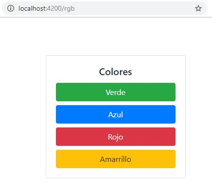
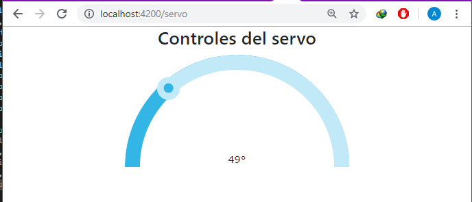
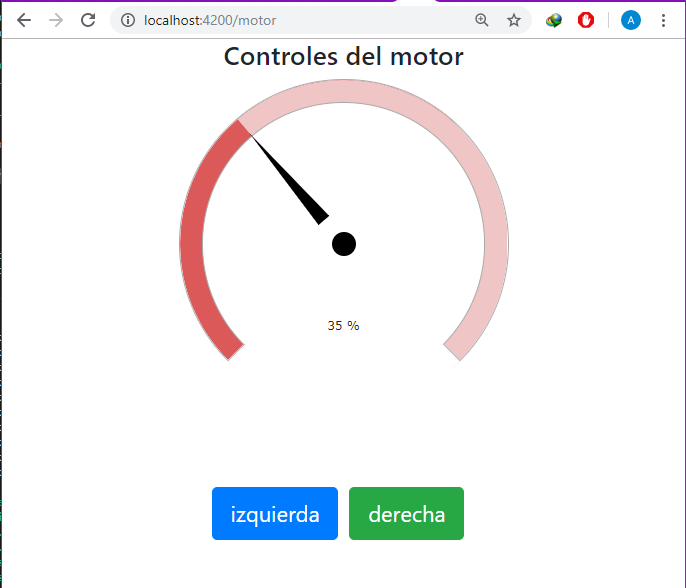

# Controlador

Interfaz cliente para la manipulación de sensores

- En el archivo src/app/app.module.ts se configura la direccion del Socket Server por default tiene la siguiente configuración: 
```
const config: SocketIoConfig = { url: 'http://192.168.43.142:8080', options: {} };
```
- El server es creado con Node (https://github.com/KernelWar/arduino-johnny)

<div>
	
	
	
</div>
